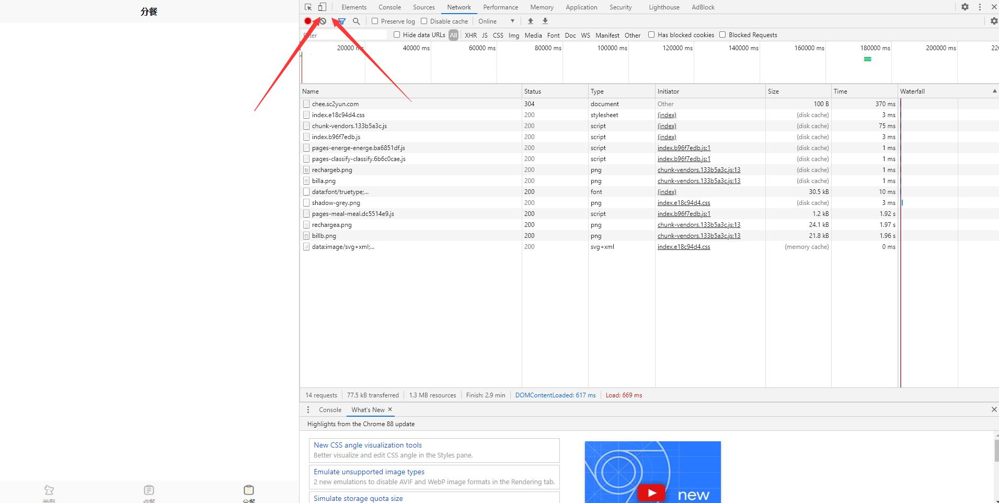

# Diabetes-Recipe

## Develop Guide

### 开发

项目有两种方式进行开发

> 方法一：使用vue-cli
> 1. 安装nodejs环境 13.x/14.x/15.x
> 2. 在diabetesRecipe根目录下执行npm install
> 3. 执行 npm run serve
> 4. 访问127.0.0.1:8080查看网页渲染情况

> 方法二：Hbuilderx
>
> ~~用hbuilderx打开diabetesRecipe/src文件夹，运行到浏览器查看网页渲染情况~~
> 在文件夹下执行```npm install```
>
> 用HBuilderX打开diabetesRecipe文件夹，运行到浏览器。此时项目依赖```npm install```下载的依赖启动项目，否则项目无法启动（更重要的用这样的方法的原因是需要使用uniCloud进行云开发）


### 编译
```npm install```

```npm run build```

编译好的静态网页到了dist/build/h5文件夹下

### uniapp云开发uniCloud
> 在HBuilderX右键uniCloud目录，创建并绑定自己的阿里云服务空间。
> 关于云函数的使用，可以连接本地云函数，或者右键uniCloud/cloudfunctions目录上传所有云函数，如此可连接云端云函数。
> 初始化云端数据库，右键uniCloud/database/db_init.json文件，初始化云端数据库，即可在云端生成数据表

### 微信开发
> 使用uniCloud进行云开发，项目使用了uniapp自带的uniid模块。如果要使用微信的登录等等(需要用到微信openid的地方),需要配置uniCloud-aliyun/cloudfunctions/common/uni-id/config.json 配置小程序的appid与appsecret。目前项目使用的测试账号

### uniCloud数据库的设计
> 食物已全存数据库，量表数据计划全存数据库，用户食谱记录

### Tips
> 小程序可以编译到微信小程序开发者工具实时查看效果。如果需要在网页浏览器中查看效果，建议使用Chrome浏览器，并用F12或者Fn+F12打开开发者工具，在点击开发者工具左上角第二个按钮(toggle device toolbar)，将浏览器从电脑端模式切换到移动端模式，查看类似手机屏幕的实时渲染效果


## CI/CD

> ~~每一次代码提交github会自动进行代码检查，并将源码进行编译为h5静态页面，部署到网站~~
> 由于现在使用了uniCloud,此功能炸炸...
> 网站目前地址：http://chee.sc2yun.com/#/
